# Potriv — Implementation Plan

**Version:** 0.1  
**Project:** Potriv  
**Repository:** `potriv`  
**Primary domain:** `https://potriv.aydgn.me`  
**API domain:** `https://api.potriv.aydgn.me`  
**Architecture style:** Modular Monolith, microservice-ready  
**Backend package:** `me.aydgn.potriv`  

---

## 1. Purpose

Potriv is a web-based team allocation and skill matching platform for organizations.

The platform helps organizations manage employees, departments, skills, projects, team roles, availability, and assignment approval workflows. The core business value is helping project managers find suitable employees for a project based on skill match, availability, previous project experience, and organization rules.

---

## 2. Product Scope

### 2.1 MVP Scope

The first version focuses on the core features:

- Organization Admin registration
- Employee registration through organization invite URL
- Authentication and JWT-based session management
- Role-based access control
- Custom team role management
- Department management
- Department manager assignment
- Department member assignment
- Skill category and skill management
- Employee skill assignment
- Project creation and update
- Team Finder search and scoring
- Assignment proposal
- Deallocation proposal
- Department manager confirmation/rejection
- Project team view
- Employee project view
- Department project view
- Project details view

### 2.2 Out of MVP / Later Scope

These features are planned after the MVP:

- Notifications
- Skill statistics
- Skill endorsement
- Skill validation by department manager
- AI expert finder
- Skill upgrade proposals
- Advanced dashboard analytics

---

## 3. Architecture Decision

### 3.1 Selected Architecture

Potriv starts as a **modular monolith**.

Reason:

- The domain is complex, but the first version should avoid distributed-system overhead.
- A single backend service is easier to develop, test, deploy, and debug.
- Internal modules are designed around bounded contexts, so they can be extracted into microservices later.

### 3.2 Target Future Architecture

The backend can later be split into:

- `identity-service`
- `people-service`
- `project-service`
- `notification-service`
- `gateway-service`

---

## 4. Technology Stack

### 4.1 Backend

- Java 21
- Spring Boot 3
- Spring Web MVC
- Spring Security
- Spring Data JPA
- Hibernate
- PostgreSQL
- Flyway
- JWT authentication
- OpenAPI / Swagger
- JUnit 5
- Mockito
- Testcontainers

### 4.2 Frontend

- React
- TypeScript
- Vite
- React Router
- TanStack Query
- Tailwind CSS
- Zod
- Axios or Fetch wrapper

### 4.3 Infrastructure

- Docker
- Docker Compose
- PostgreSQL
- Azure App Service or Render/Railway for deployment
- GitHub Actions for CI/CD

---

## 5. Monorepo Structure

```text
potriv/
├── apps/
│   ├── backend/
│   │   ├── src/
│   │   ├── pom.xml
│   │   └── Dockerfile
│   │
│   └── frontend/
│       ├── src/
│       ├── package.json
│       └── Dockerfile
│
├── docs/
│   ├── architecture/
│   │   └── implementation-plan.md
│   ├── api/
│   │   └── api-contract.md
│   ├── database/
│   │   └── database-model.md
│   └── planning/
│       └── backlog.md
│
├── infra/
│   ├── docker/
│   └── azure/
│
├── docker-compose.yml
├── README.md
└── .gitignore
```

---

## 6. End-to-End System Diagram

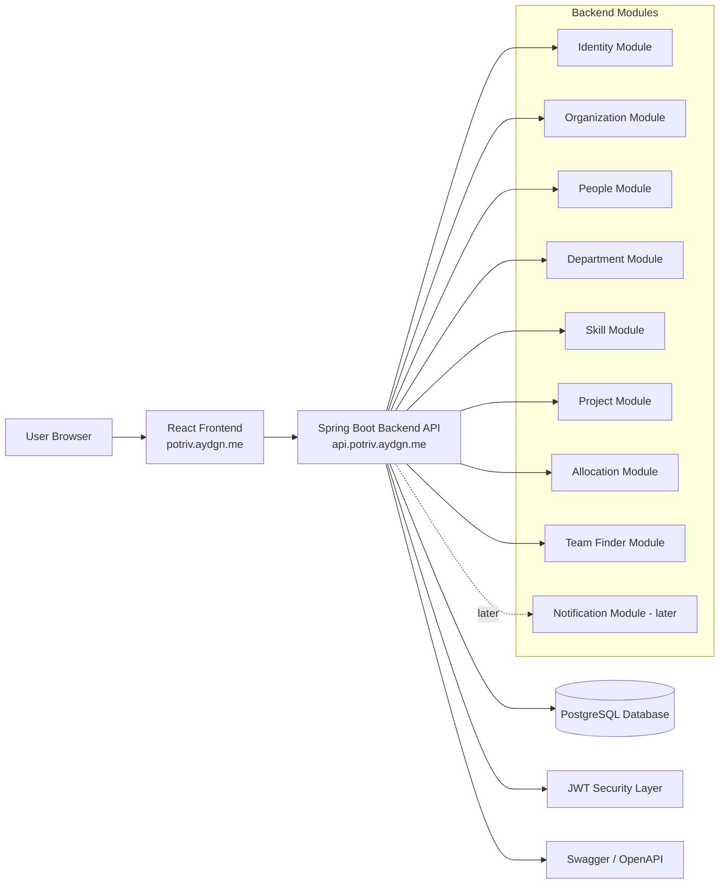

---

## 7. C4 Context Diagram

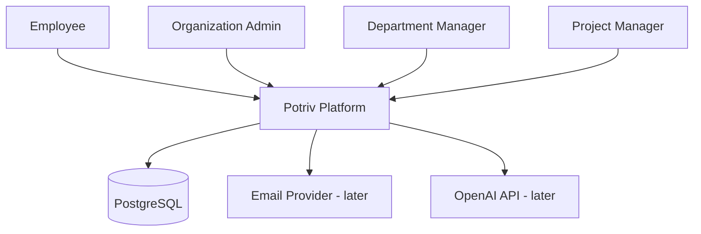

---

## 8. Container Diagram

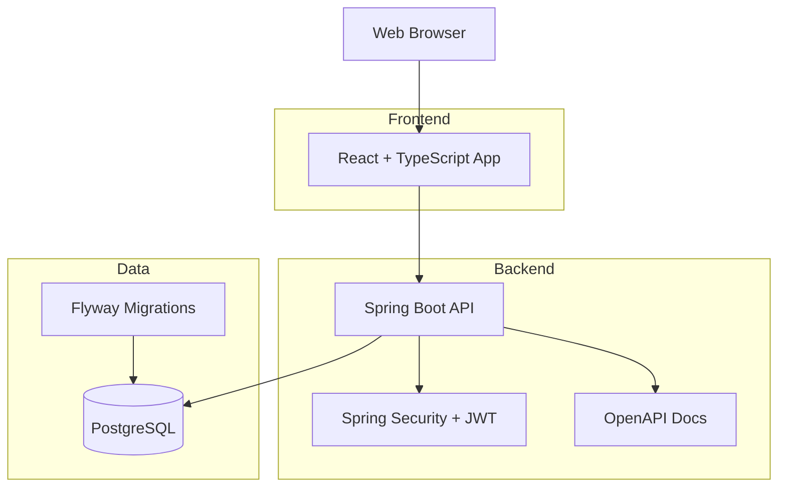

---

## 9. Backend Modular Design

```text
apps/backend/src/main/java/me/aydgn/potriv/
├── PotrivApplication.java
│
├── identity/
│   ├── controller/
│   ├── service/
│   ├── repository/
│   ├── entity/
│   ├── dto/
│   └── security/
│
├── organization/
│   ├── controller/
│   ├── service/
│   ├── repository/
│   ├── entity/
│   └── dto/
│
├── people/
│   ├── employee/
│   ├── department/
│   └── skill/
│
├── project/
│   ├── controller/
│   ├── service/
│   ├── repository/
│   ├── entity/
│   └── dto/
│
├── allocation/
│   ├── controller/
│   ├── service/
│   ├── repository/
│   ├── entity/
│   └── dto/
│
├── teamfinder/
│   ├── controller/
│   ├── service/
│   ├── scoring/
│   └── dto/
│
├── notification/
│   └── later/
│
└── common/
    ├── config/
    ├── exception/
    ├── response/
    ├── validation/
    └── security/
```

---

## 10. Request Lifecycle Diagram

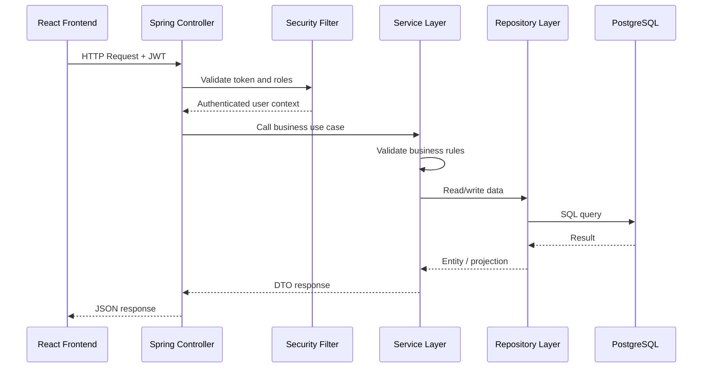

---

## 11. Authentication Flow

### 11.1 Organization Admin Signup

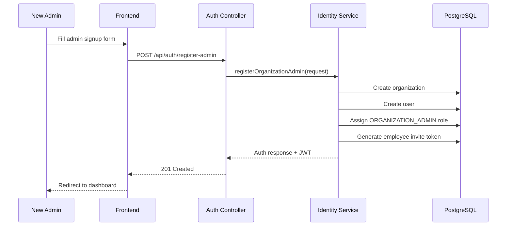

### 11.2 Employee Signup by Invite URL

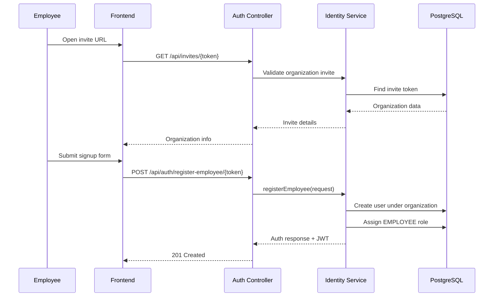

---

## 12. Role-Based Access Control

### 12.1 Access Roles

| Role | Description |
|---|---|
| `EMPLOYEE` | Default user role. Can manage own skills and view own projects. |
| `ORGANIZATION_ADMIN` | Manages organization users, departments, roles, and team roles. |
| `DEPARTMENT_MANAGER` | Manages department members, department skills, and assignment approvals. |
| `PROJECT_MANAGER` | Creates projects, searches employees, and proposes assignment/deallocation. |

### 12.2 Role Matrix

| Feature | Employee | Org Admin | Dept Manager | Project Manager |
|---|---:|---:|---:|---:|
| Manage own skills | Yes | Yes | Yes | Yes |
| View own projects | Yes | Yes | Yes | Yes |
| Assign access roles | No | Yes | No | No |
| Manage team roles | No | Yes | No | No |
| Manage departments | No | Yes | No | No |
| Assign department manager | No | Yes | No | No |
| Assign department members | No | No | Yes | No |
| Manage skills | No | No | Yes | No |
| Create projects | No | No | No | Yes |
| Run Team Finder | No | No | No | Yes |
| Propose assignment | No | No | No | Yes |
| Approve assignment | No | No | Yes | No |
```

---

## 13. Core Database Model

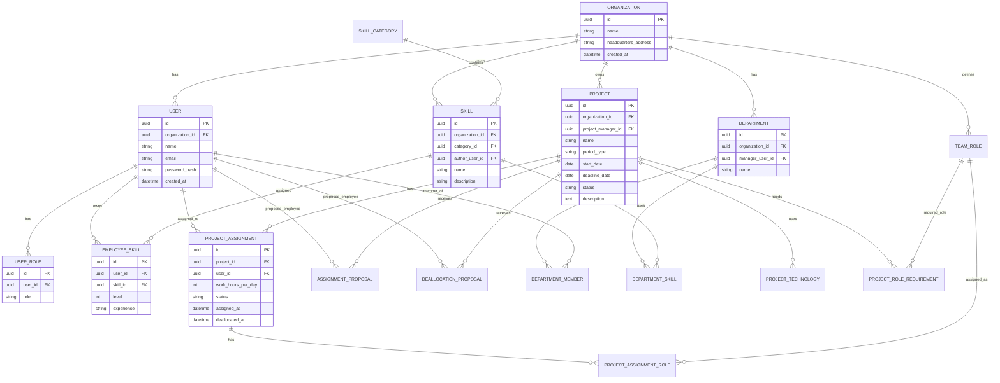

---

## 14. Team Finder Algorithm

### 14.1 Availability Rule

```text
available_hours = 8 - sum(active project assignment hours per day)
```

| Condition | Meaning |
|---|---|
| `available_hours = 8` | Fully available |
| `available_hours > 0 and < 8` | Partially available |
| `available_hours = 0` | Unavailable |

### 14.2 Scoring Model

Initial scoring formula:

```text
score = skill_match_score
      + experience_score
      + past_project_similarity_score
      + availability_score
```

Suggested weights:

| Factor | Score |
|---|---:|
| Exact technology/skill match | +40 |
| Skill category match | +15 |
| Skill level 5 - Teaches | +25 |
| Skill level 4 - Helps | +20 |
| Skill level 3 - Does | +10 |
| Past similar project | +20 |
| Fully available | +20 |
| Partially available | +10 |
| Unavailable but included by filter | -20 |

---

## 15. Team Finder Flow

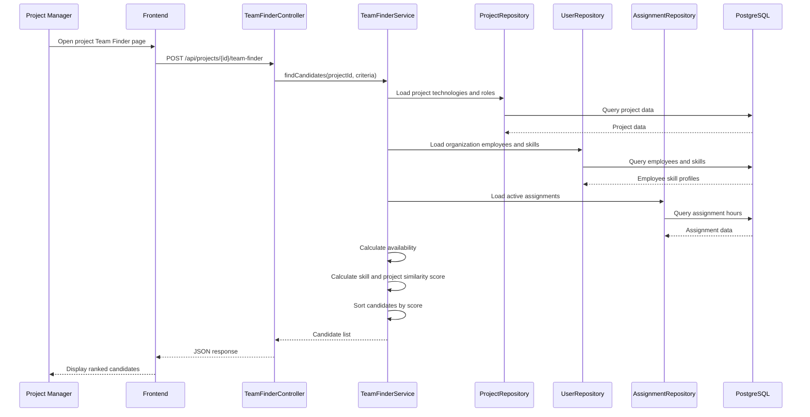

---

## 16. Assignment Proposal Flow

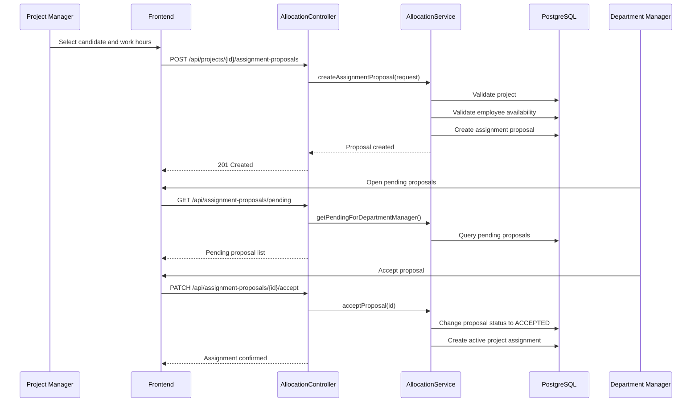

---

## 17. Deallocation Proposal Flow

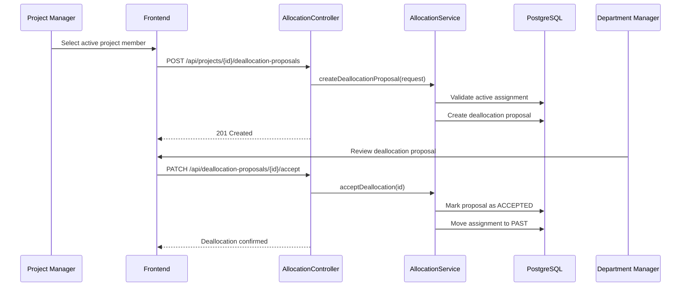

---

## 18. Frontend Route Map

```text
/
├── /login
├── /register/admin
├── /register/employee/:inviteToken
│
├── /app
│   ├── /dashboard
│   │
│   ├── /admin
│   │   ├── /employees
│   │   ├── /roles
│   │   ├── /departments
│   │   └── /team-roles
│   │
│   ├── /department
│   │   ├── /members
│   │   ├── /unassigned-employees
│   │   ├── /skills
│   │   └── /assignment-requests
│   │
│   ├── /skills
│   │   └── /my-skills
│   │
│   ├── /projects
│   │   ├── /
│   │   ├── /new
│   │   ├── /:projectId
│   │   ├── /:projectId/team
│   │   ├── /:projectId/team-finder
│   │   └── /:projectId/settings
│   │
│   └── /profile
```

---

## 19. API Contract Draft

### 19.1 Auth

```text
POST /api/auth/register-admin
POST /api/auth/register-employee/{inviteToken}
POST /api/auth/login
POST /api/auth/refresh
POST /api/auth/logout
GET  /api/auth/me
```

### 19.2 Organization

```text
GET /api/organization/current
GET /api/organization/invite-url
POST /api/organization/invite-token/regenerate
```

### 19.3 Users and Roles

```text
GET   /api/users
GET   /api/users/{id}
PATCH /api/users/{id}/roles
```

### 19.4 Departments

```text
GET    /api/departments
POST   /api/departments
GET    /api/departments/{id}
PATCH  /api/departments/{id}
DELETE /api/departments/{id}
PATCH  /api/departments/{id}/manager
POST   /api/departments/{id}/members
DELETE /api/departments/{id}/members/{userId}
GET    /api/departments/unassigned-employees
```

### 19.5 Skills

```text
GET    /api/skill-categories
POST   /api/skill-categories
GET    /api/skills
POST   /api/skills
GET    /api/skills/{id}
PATCH  /api/skills/{id}
DELETE /api/skills/{id}
GET    /api/me/skills
POST   /api/me/skills
DELETE /api/me/skills/{skillId}
```

### 19.6 Team Roles

```text
GET    /api/team-roles
POST   /api/team-roles
PATCH  /api/team-roles/{id}
DELETE /api/team-roles/{id}
```

### 19.7 Projects

```text
GET    /api/projects
POST   /api/projects
GET    /api/projects/{id}
PATCH  /api/projects/{id}
DELETE /api/projects/{id}
GET    /api/me/projects
GET    /api/department/projects
```

### 19.8 Team Finder and Allocation

```text
POST  /api/projects/{id}/team-finder
POST  /api/projects/{id}/assignment-proposals
POST  /api/projects/{id}/deallocation-proposals
GET   /api/assignment-proposals/pending
PATCH /api/assignment-proposals/{id}/accept
PATCH /api/assignment-proposals/{id}/reject
PATCH /api/deallocation-proposals/{id}/accept
PATCH /api/deallocation-proposals/{id}/reject
GET   /api/projects/{id}/team
```

---

## 20. Deployment Diagram

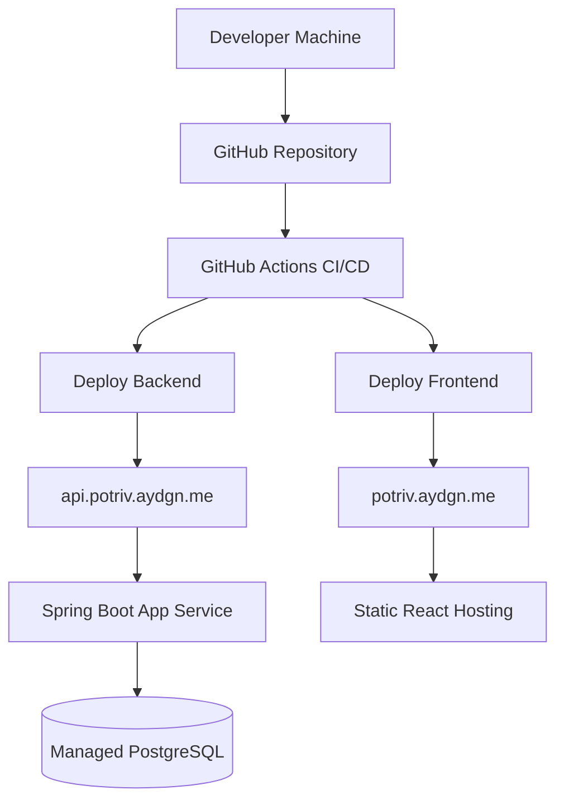

---

## 21. Local Development Setup

```text
Frontend: http://localhost:5173
Backend:  http://localhost:8080
Database: localhost:5432
Swagger:  http://localhost:8080/swagger-ui/index.html
```

### 21.1 Local Docker Compose

```yaml
services:
  postgres:
    image: postgres:16
    container_name: potriv-postgres
    environment:
      POSTGRES_DB: potriv
      POSTGRES_USER: potriv
      POSTGRES_PASSWORD: potriv
    ports:
      - "5432:5432"
    volumes:
      - potriv_postgres_data:/var/lib/postgresql/data

volumes:
  potriv_postgres_data:
```

---

## 22. Environment Variables

### 22.1 Backend Local

```env
APP_NAME=Potriv
APP_FRONTEND_URL=http://localhost:5173
APP_API_URL=http://localhost:8080
JWT_ISSUER=http://localhost:8080
JWT_SECRET=local-development-secret-change-me
CORS_ALLOWED_ORIGINS=http://localhost:5173
SPRING_DATASOURCE_URL=jdbc:postgresql://localhost:5432/potriv
SPRING_DATASOURCE_USERNAME=potriv
SPRING_DATASOURCE_PASSWORD=potriv
```

### 22.2 Frontend Local

```env
VITE_API_BASE_URL=http://localhost:8080/api
```

### 22.3 Production

```env
APP_FRONTEND_URL=https://potriv.aydgn.me
APP_API_URL=https://api.potriv.aydgn.me
JWT_ISSUER=https://api.potriv.aydgn.me
CORS_ALLOWED_ORIGINS=https://potriv.aydgn.me
VITE_API_BASE_URL=https://api.potriv.aydgn.me/api
```

---

## 23. Quality Strategy

### 23.1 Backend Tests

Required test levels:

- Unit tests for services
- Unit tests for Team Finder scoring
- Repository tests with Testcontainers
- Controller tests for important endpoints
- Security tests for role-based access

### 23.2 Frontend Tests

Initial frontend tests:

- Auth form validation
- Protected route behavior
- Role-based navigation visibility
- Team Finder result rendering
- Project creation form validation

### 23.3 Manual QA

Manual QA will cover:

- Admin signup
- Employee signup with invite URL
- Login/logout
- Role assignment
- Department creation
- Manager assignment
- Member assignment
- Skill creation
- Employee skill assignment
- Project creation
- Team Finder search
- Assignment proposal
- Approval/rejection
- Project team view

---

## 24. Implementation Roadmap

### Milestone 0 — Repository and Project Foundation

Deliverables:

- Monorepo initialized
- Backend Spring Boot project created
- Frontend Vite React project created
- Docker Compose with PostgreSQL
- README created
- Basic CI workflow

### Milestone 1 — Backend Foundation

Deliverables:

- Common response model
- Exception handling
- Validation error handling
- Flyway setup
- PostgreSQL connection
- OpenAPI setup
- Health endpoint

### Milestone 2 — Identity and Organization

Deliverables:

- Organization Admin signup
- Employee invite token
- Employee signup by invite URL
- Login
- JWT generation
- Current user endpoint
- Password hashing

### Milestone 3 — Roles and Departments

Deliverables:

- Access role assignment
- Team role CRUD
- Department CRUD
- Department manager assignment
- Department member assignment
- Unassigned employee list

### Milestone 4 — Skills

Deliverables:

- Skill category CRUD
- Skill CRUD
- Department-skill linking
- Employee skill assignment
- My skills page/API

### Milestone 5 — Projects

Deliverables:

- Project CRUD
- Project status validation
- Technology stack
- Team role requirements
- Employee projects view
- Department projects view
- Project details view

### Milestone 6 — Allocation Workflow

Deliverables:

- Team Finder candidate search
- Availability calculation
- Scoring algorithm
- Assignment proposal
- Deallocation proposal
- Department manager approval/rejection
- Project team sections: proposed, active, past

### Milestone 7 — Frontend MVP Completion

Deliverables:

- Login/register screens
- Dashboard
- Admin screens
- Department manager screens
- Employee skill screens
- Project manager screens
- Team Finder UI
- Assignment approval UI

### Milestone 8 — Polish, Tests, Deployment

Deliverables:

- Backend unit/integration tests
- Frontend validation checks
- Docker production build
- Public frontend URL
- Public API URL
- Swagger documentation
- Final README
- Architecture documentation

---

## 25. Initial Backlog

### Epic 1 — Project Setup

| Task | Type | Priority |
|---|---|---|
| Initialize monorepo | Chore | High |
| Create Spring Boot backend | Chore | High |
| Create React frontend | Chore | High |
| Add Docker Compose PostgreSQL | Chore | High |
| Add README and docs folders | Docs | Medium |

### Epic 2 — Backend Core

| Task | Type | Priority |
|---|---|---|
| Configure PostgreSQL connection | Backend | High |
| Configure Flyway | Backend | High |
| Add global exception handler | Backend | High |
| Add common API response structure | Backend | Medium |
| Add Swagger/OpenAPI | Backend | Medium |

### Epic 3 — Identity

| Task | Type | Priority |
|---|---|---|
| Create organization entity | Backend | High |
| Create user entity | Backend | High |
| Create user role entity | Backend | High |
| Implement admin registration | Backend | High |
| Implement employee invite token | Backend | High |
| Implement employee registration | Backend | High |
| Implement login | Backend | High |
| Implement JWT security | Backend | High |

### Epic 4 — People and Skills

| Task | Type | Priority |
|---|---|---|
| Implement department CRUD | Backend | High |
| Implement department manager assignment | Backend | High |
| Implement department member assignment | Backend | High |
| Implement skill category CRUD | Backend | Medium |
| Implement skill CRUD | Backend | High |
| Implement employee skill assignment | Backend | High |

### Epic 5 — Projects and Allocation

| Task | Type | Priority |
|---|---|---|
| Implement project CRUD | Backend | High |
| Implement project status validation | Backend | High |
| Implement team role requirements | Backend | Medium |
| Implement availability calculation | Backend | High |
| Implement Team Finder scoring | Backend | High |
| Implement assignment proposal | Backend | High |
| Implement deallocation proposal | Backend | High |
| Implement approval/rejection | Backend | High |

### Epic 6 — Frontend

| Task | Type | Priority |
|---|---|---|
| Create app shell and routing | Frontend | High |
| Create auth screens | Frontend | High |
| Create admin dashboard | Frontend | High |
| Create department screens | Frontend | High |
| Create skill screens | Frontend | High |
| Create project screens | Frontend | High |
| Create Team Finder UI | Frontend | High |
| Create assignment approval UI | Frontend | High |

---

## 26. Definition of Done

A feature is done when:

- API endpoint is implemented
- Request validation exists
- Authorization rules are enforced
- Business constraints are tested
- Database migration is included
- Swagger documentation is visible
- Frontend screen or integration exists when applicable
- Error states are handled
- Code is committed with meaningful commit message

---

## 27. Risks and Mitigation

| Risk | Impact | Mitigation |
|---|---|---|
| Authorization rules become complex | High | Keep role checks centralized in security services |
| Team Finder algorithm becomes too large | Medium | Start with simple deterministic scoring |
| Frontend grows too fast | Medium | Use feature folders and reusable components |
| Database relationships become hard to manage | High | Use Flyway and explicit ERD documentation |
| Microservice idea slows MVP | High | Start with modular monolith only |
| Deployment consumes too much time | Medium | Deploy frontend and backend separately with simple env config |

---

## 28. Future Microservice Extraction Plan

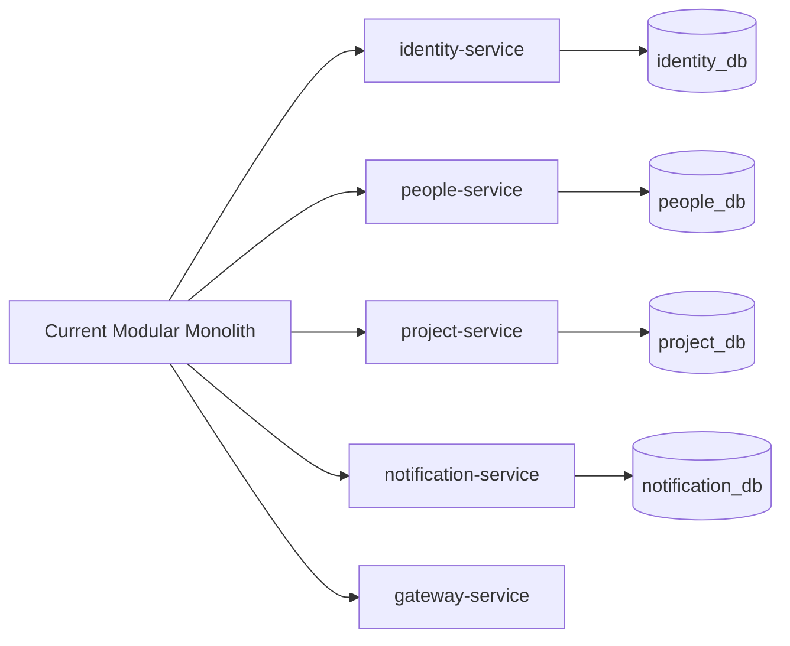

Extraction order:

1. Notification module
2. Identity module
3. People module
4. Project and allocation module
5. API Gateway

---

## 29. Final Architecture Summary

Potriv will be implemented as a Java Spring Boot modular monolith inside a monorepo. The backend follows Controller-Service-Repository layering and is organized by business modules. The frontend is a React TypeScript application deployed separately from the backend. PostgreSQL is used as the primary database. The system is designed to satisfy the MVP requirements first, while keeping a clean path toward future microservice extraction.
